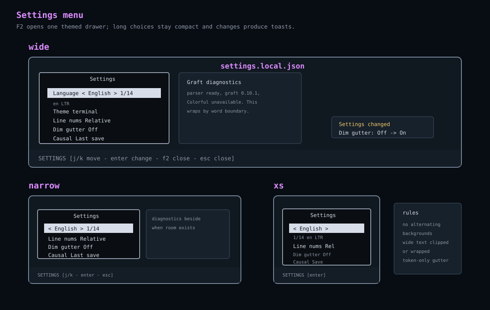

# Settings Menu

The settings menu is Jim's in-app preferences drawer. It should look like the
rest of Jim, use theme tokens, and keep long option sets compact.



## How To Access It

Press `F2` from the title screen or editor.

Close the settings menu with:

| Key | Action |
| --- | --- |
| `F2` | Close settings. |
| `Esc` | Close settings or the active settings subpanel. |
| `q` | Close settings. |

## Navigation

Use the keyboard while the settings drawer is focused:

| Key | Action |
| --- | --- |
| `j` or `Down` | Move to the next setting. |
| `k` or `Up` | Move to the previous setting. |
| `Enter` or `Space` | Change the selected setting. |
| `Left` | Move the selected choice backward when the row supports choices. |
| `Right` | Move the selected choice forward when the row supports choices. |

The selected row uses the theme cursor token. Non-selected rows should share
the drawer background rather than alternating unrelated colors.

## Current Rows

The settings drawer can include these rows, depending on runtime capabilities:

| Row | Purpose |
| --- | --- |
| `Language` | Cycle the active UI locale. |
| `Theme` | Cycle the active theme. |
| `Theme mode` | Switch automatic, dark, or light mode. |
| `Footer` | Toggle expanded footer details. |
| `Line numbers` | Switch absolute or cursor-relative gutter line numbers. |
| `Dim gutter` | Select the theme's dimmed gutter token set. |
| `Causal markers` | Choose the causal head used as the gutter comparison basis. |
| `Markdown preview` | Toggle Markdown preview when supported for the current buffer. |
| `Diagnostics` | Open or close the diagnostics panel. |

Language should stay compact because the locale list is long. The row should
show only the current locale and position, for example:

```text
<- English ->
1/14
```

Jim may render that as one row when terminal height is tight. The important
contract is that the full locale list does not push a tall multilingual menu
through the drawer.

## Causal Marker Basis

The causal marker setting changes which retained head the gutter projection
compares with the current admitted head:

| Choice | Comparison basis |
| --- | --- |
| `Last save` | The head used for the latest successful file materialization. |
| `Import` | The head created when the buffer entered the current Jim session. |

Selected-checkpoint and selected-tick choices were removed with the
process-local history drawer. They may return only when a bounded Echo
observation supplies matching opaque head and receipt evidence.

Changing this setting updates only a bounded causal-line reading. It does not
submit an edit, advance a worldline, declare a checkpoint, save a file, or mint
Echo authority. Stale readings are ignored unless their buffer, current head,
and selected comparison head still match.

## Gutter Appearance

`Dim gutter` selects between the theme's complete `gutter.normal` and
`gutter.dimmed` token sets. It does not calculate colors in the renderer.
Both sets define explicit tokens for the background, ordinary and current line
numbers, rule, inserted marker, modified marker, deleted marker, pending
proposal, and obstructed proposal. A token set is complete only when all nine
roles are present. Every gutter token carries the theme `surface` background so
a missing token background cannot expose the terminal's default color.

Built-in light and dark themes witness at least 3:1 foreground-to-background
contrast for every gutter role. When a semantic palette color cannot meet that
floor, theme construction falls back to the theme's named `ink` variable. No
gutter role uses a hard-coded renderer color.

## Setting Feedback

Every setting change should create a short confirmation toast with:

- the setting name;
- the previous value;
- the new value.

Example:

```text
Settings changed
Line numbers: Absolute -> Relative
```

Toasts should confirm changes, not replace durable help. If a setting opens a
subpanel or diagnostic report, that readable content should remain on screen
until the user closes it or moves focus away.

## Diagnostics

The diagnostics setting opens a diagnostics panel beside the settings drawer
when there is enough room. It should not replace the settings drawer or erase
the user's focus context.

Diagnostic text should wrap at word boundaries inside its viewport. Long codes
or paths may be clipped, but ordinary prose should not split mid-word unless no
word boundary is available.

## Footer Coordinate

While settings has focus, the footer should describe settings focus. It should
not show the editor cursor as if the user were still editing source. A footer
such as `SETTINGS 9:1` is misleading if `9:1` came from the hidden editor
cursor.

## Implementation Map

| File | Responsibility |
| --- | --- |
| [`src/app/settings-session.ts`](../../../src/app/settings-session.ts) | Settings rows, focus movement, and key actions. |
| [`src/app/workspace/settings.ts`](../../../src/app/workspace/settings.ts) | Workspace handlers for applying setting changes. |
| [`src/app/workspace/settings-key-bindings.ts`](../../../src/app/workspace/settings-key-bindings.ts) | Settings key dispatch and change notifications. |
| [`src/app/workspace/workspace-causal-gutter-basis.ts`](../../../src/app/workspace/workspace-causal-gutter-basis.ts) | Save/import comparison choices and evidence validation. |
| [`src/app/workspace/workspace-causal-line-change-refresh.ts`](../../../src/app/workspace/workspace-causal-line-change-refresh.ts) | Bounded refresh commands and stale-result refusal. |
| [`src/ui/settings-drawer.ts`](../../../src/ui/settings-drawer.ts) | Drawer rendering. |
| [`src/ui/jedit-theme.ts`](../../../src/ui/jedit-theme.ts) | Normal and dimmed gutter token contracts. |
| [`src/ui/jedit-themes.ts`](../../../src/ui/jedit-themes.ts) | Built-in token selection and contrast policy. |
| [`src/app/workspace/viewer-overlays.ts`](../../../src/app/workspace/viewer-overlays.ts) | Settings plus diagnostics overlay composition. |
| [`src/ui/graft-diagnostics-panel.ts`](../../../src/ui/graft-diagnostics-panel.ts) | Diagnostics panel rendering and wrapping. |
