# Title Screen

The title screen is the first Jim surface when no file has been opened. It is
both a product identity surface and a usable file-opening surface.



## How To Open It

Start Jim without a file argument:

```sh
npm run dev
```

In an installed build, launch the Jim executable without a path. The title
screen remains active until a file or workspace entry is opened.

## What It Shows

The current title screen renders a ray-traced scene in terminal cells. The
scene is decorative, but it is still a live Jim screen and must obey the same
chrome rules as the editor:

- the active title appears in the top chrome;
- performance and scene details can appear in debug overlays;
- footer hints describe available navigation and command shortcuts;
- file opening should route through the same production text path as later
  editor commands.

The title renderer is intentionally separate from source editing. It must not
own text authority, file authority, or settings authority.

## Keyboard Use

Common title-screen actions:

| Key | Action |
| --- | --- |
| `:` | Open Normal-mode command line. |
| `ctrl+b` | Open the files drawer. |
| `ctrl+g` | Open the Graft drawer when available. |
| `ctrl+t` | Cycle theme. |
| `F2` | Open settings. |

The exact footer text is the runtime hint source. If this page and the footer
disagree, the footer is more likely to match the running build.

## File Opening

From the title screen, `:edit <path>` and file completion should use the same
workspace file-opening behavior as the files drawer. Selecting a directory must
descend into that directory. Selecting a file must open it through the
production Echo-backed text session.

## Implementation Map

| File | Responsibility |
| --- | --- |
| [`src/ui/title-screen.ts`](../../../src/ui/title-screen.ts) | Title scene surface rendering. |
| [`src/ui/title-scene.ts`](../../../src/ui/title-scene.ts) | Ray-traced title scene rendering. |
| [`src/app/title-camera-session.ts`](../../../src/app/title-camera-session.ts) | Title camera interaction state. |
| [`src/app/workspace/title-screen-key-bindings.ts`](../../../src/app/workspace/title-screen-key-bindings.ts) | Title-screen key routing. |
| [`src/app/workspace/file-tree.ts`](../../../src/app/workspace/file-tree.ts) | Shared file entry open behavior. |
